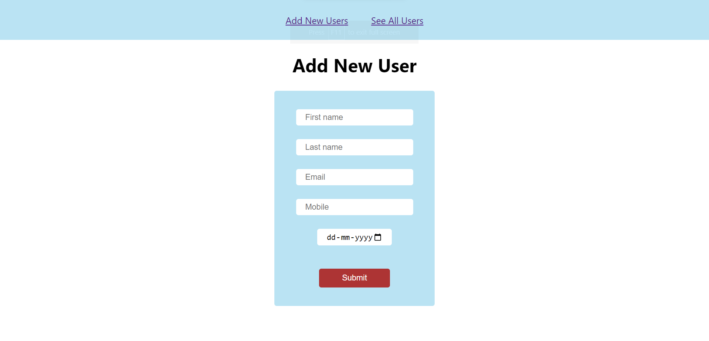
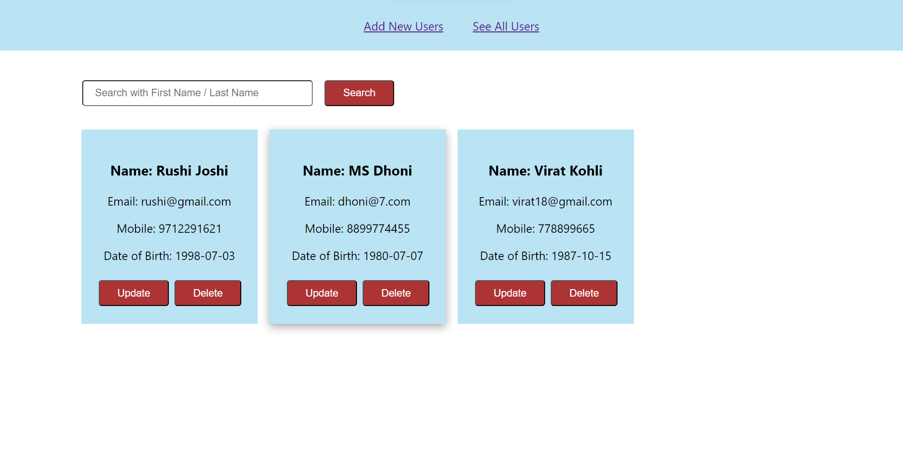

# MERN-Mini_project-6 (CRUD Application)

<h3>This CRUD App is a mini-project using the MERN stack. The purpose to make this is for practicing the concepts of MERN stack & exploring new things.
</h3>
<h4>It's a Deployed App.</h4>
<h4>Frontend Deployed on Vercel</h4>
<h4>Backend Deployed on Cyclic</h4>
<h4>Database - MongoDB</h4>

# Deployed Frontend URL 👉 [Click here]([https://frontend-rushijoshi3798.vercel.app/])
# Deployed Backend URL 👉 [Click here]([https://brainy-bull-threads.cyclic.app/])

- Rushi Joshi   (My Linkedin profile :- https://www.linkedin.com/in/rushijoshi3798/)  
              (My Portfolio:- https://rushijoshi3798.github.io/)
   
  
- Source Code(GitHub link):- https://github.com/Rushijoshi3798/MERN-Mini_project-6

## Home page :

## Users page :

## Show your support

Give a ⭐️ if you like this project!

### Thank you